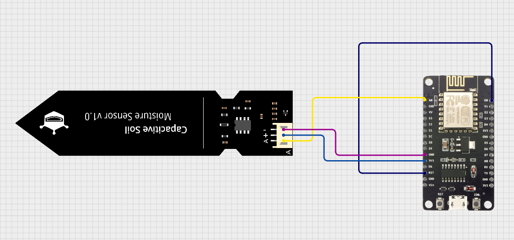

Schema for the nodemcu
- **Capacitive Soil Moisture Sensor V2**:
   - **VCC** → **3.3V** (NodeMCU)
   - **GND** → **GND** (NodeMCU)
   - **AOUT** → **A0** (NodeMCU)
- **DOUT** → **D0** (NodeMCU, connected to RST for wake-up)

```
┌───────────────────────┐           ┌─────────────────────────────┐
│       NodeMCU         │           │  Capacitive Moisture Sensor │
│      (ESP8266)        │           │            V2               │
├───────┬───────────────┤           ├───────┬─────────────────────┤
│ 3.3V  │───────────────┼──────────→│ VCC   │
│ GND   │───────────────┼──────────→│ GND   │
│ A0    │───────────────┼──────────→│ A0    │ (Analog Output)
│       │               │           │       │
│ D0    │ ─┐            │           │       │
│ RST   │ ←┘            │           │       │
└───────┴───────────────┘           └───────┘
```

